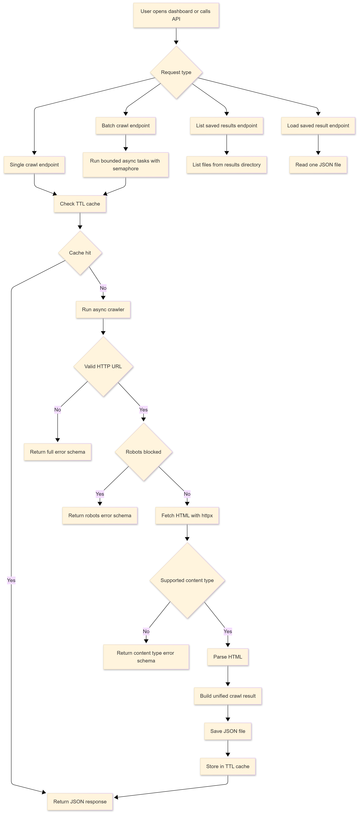
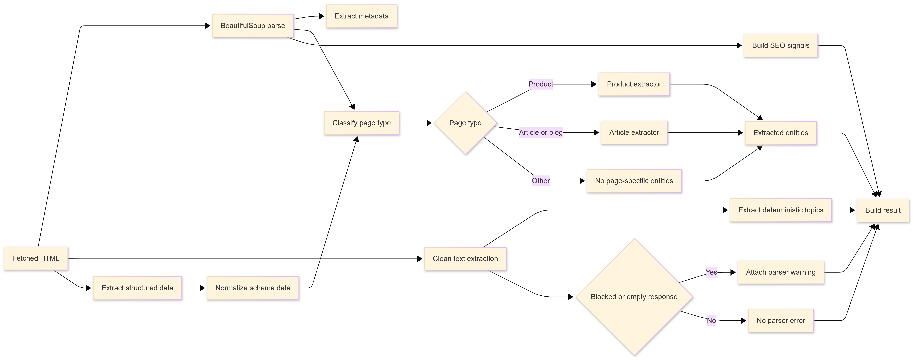
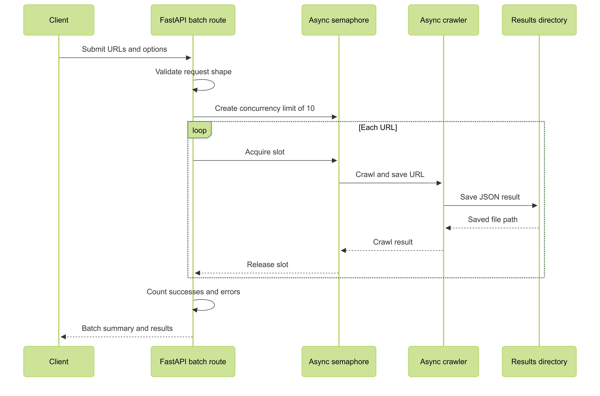
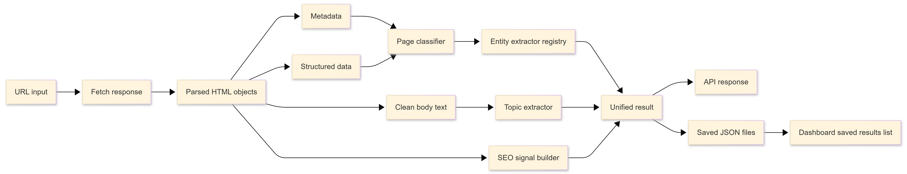

# BrightEdge Crawler

A FastAPI-based URL crawler that fetches HTML pages, follows redirects, classifies page type, extracts metadata/content/entities, and presents the result in a simple local dashboard.

## What It Does

- Crawls a single URL or a bounded batch of URLs.
- Extracts metadata, JSON-LD/schema signals, clean body text, topics, SEO signals, and page-specific entities.
- Supports product and article/blog extraction paths.
- Saves crawl outputs as JSON files in `results/`.
- Serves a local dashboard at `/` for running crawls and reviewing saved results.
- Ships with Docker Compose for local container testing.

## Project Layout

```text
.
|-- main.py                  # FastAPI app, cache, persistence, API routes, dashboard serving
|-- crawl_bulk.py            # CLI runner for URL files
|-- crawlEdge/
|   |-- crawler.py           # Public crawler facade
|   |-- http_client.py       # URL validation, robots check, HTTP fetch
|   |-- parser.py            # HTML parsing and result assembly
|   |-- classifier.py        # Page type detection
|   |-- schemas.py           # Unified result shape
|   `-- extractors/          # Metadata, structured data, topic, product, article extractors
|-- static/index.html        # Local dashboard UI
|-- tests/                   # Unit and API tests
|-- design/                  # Architecture, scope, and exported diagrams
|-- Dockerfile
`-- docker-compose.yml
```

## Run Locally

```powershell
.\.brightedge\Scripts\activate
pip install -r requirements.txt
uvicorn main:app --reload
```

Open:

```text
http://127.0.0.1:8000/
```

The dashboard starts empty and shows JSON outputs created in `results/` after you run crawls.

## Run With Docker

```powershell
docker compose up --build
```

Open:

```text
http://localhost:8000/
```

Compose mounts `./results` into the container, so saved crawl outputs remain on your machine after the container stops.

## API

Health:

```powershell
Invoke-RestMethod "http://127.0.0.1:8000/health"
```

Single crawl:

```powershell
Invoke-RestMethod "http://127.0.0.1:8000/crawl?url=https://example.com/page&force_refresh=true"
```

Batch crawl:

```powershell
Invoke-RestMethod `
  -Method Post `
  -ContentType "application/json" `
  -Uri "http://127.0.0.1:8000/crawl/batch" `
  -Body '{"urls":["https://example.com/page-one","https://example.com/page-two"],"force_refresh":true}'
```

Saved results:

```powershell
Invoke-RestMethod "http://127.0.0.1:8000/api/results"
```

## CLI

```powershell
.\.brightedge\Scripts\python.exe crawl_bulk.py --input sample_urls.txt --output-dir results --force-refresh
```

`sample_urls.txt` is only a convenience input file for local testing. The app itself does not preload sample results.

## Important Options

- `respect_robots=true`: Enforce robots.txt before fetching.
- `force_refresh=true`: Bypass the in-memory TTL cache.
- Batch requests accept 1 to 25 URLs and run with bounded concurrency.

## Output Shape

Every response uses the same top-level schema, including failures:

```json
{
  "url": "https://final-url.example/page",
  "status_code": 200,
  "crawled_at": "2026-05-25T16:45:00.000000",
  "page_type": "product | article | blog | homepage | category | other",
  "metadata": {
    "title": "...",
    "meta_description": "...",
    "og_title": "...",
    "og_description": "...",
    "language": "en"
  },
  "structured_data": {
    "json-ld": [],
    "normalized": {},
    "raw_count": {}
  },
  "body_text": "clean main content...",
  "topics": ["topic", "keyword"],
  "extracted_entities": {},
  "seo_signals": {
    "word_count": 621,
    "has_schema_markup": true,
    "h1_count": 1,
    "canonical": "https://canonical-url.example/page",
    "redirect_chain": [],
    "redirect_count": 0
  },
  "error": null
}
```

## Tests

```powershell
.\.brightedge\Scripts\python.exe -m unittest discover -s tests -v
```

The tests cover product extraction, article extraction, invalid URL error shape, and concurrent API requests.

## Design Docs

See [design/README.md](design/README.md) for scope, architecture, design patterns, and exported flow diagrams.

## Flow Diagrams








